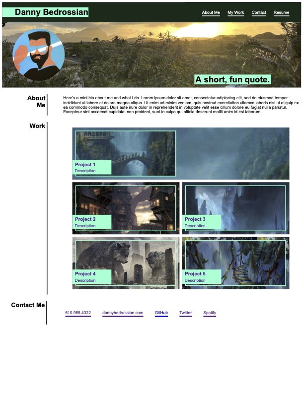

# Portfolio Page

This is a **mock-up** of a porfolio page from scratch, using HTML and CSS.

## Table of Contents

- [Background](#background)
- [Install](#install)
- [Usage](#usage)
- [Screenshot](#screenshot)
- [Maintainers](#maintainers)
- [Contributing](#contributing)
- [Contributors](#contributors)
- [License](#license)

## Background

*To incorporate everything we've learned so far about HTML and CSS* we were instructed to make a portfolio page using boxes and containers.

## Install/Link to Webpage 🔗 

Check out the link to the website:

https://dbedrossian.github.io/Mod2_Portfolio-Page/

## Usage

This is being used as an assignment project.

## Screenshot

## Maintainers

[@Danny Bedrossian](https://github.com/dbedrossian).

## Contributing

Feel free to dive in! [Open an issue](https://github.com/dbedrossian/standard-readme/issues/new) or submit PRs.

## Contributors

Tackled this one solo!

## License

© Danny Bedrossian